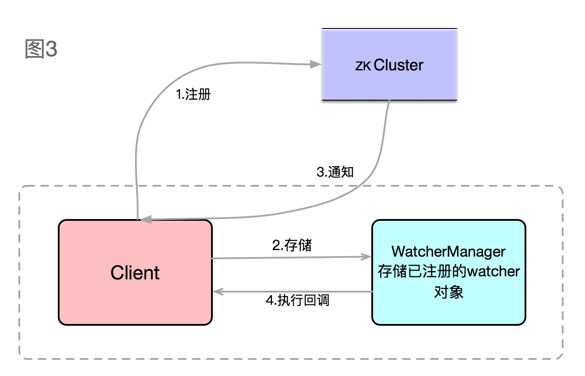

ZooKeeper

[TOC]

### ZooKeeper特性
* **最终一致性**
* **顺序性**  
    从同一客户端发起的事务请求，都会最终被严格的按照其发送顺序被应用到zk中。
* **可靠性**  
* **实时性**  
    zk不能保证多个客户端能同时得到刚更新的数据，所以如果要最新数据，需要在读数据之前强制调用sync接口来保证数据的实时性。
* **原子性**  
    要么成功，要么失败。
* **单一视图**  
    无论客户端连的是哪个节点，看到的数据模型对外一致。  
  
### 基础概念
  
  * **SID：**服务器ID，即**myid**。
  * **ZXID：**服务器的事物ID，数据越新，ZXID越大。
  * **epoch：**逻辑时钟，在服务端是一个自增序列，每一次进入下一轮投票后，值增加1。
  * **Server状态**
      * **Looking：**进入选举流程。
      * **Following：**Leader已经选出，表明当前角色为follower。
      * **Observing：**当前角色为Observer。
      * **Leading：**表明当前角色为Leader。
    
### ZooKeeper角色
集群架构图：

* **Leader**，唯一性。
    * 恢复数据
    * 维持与folloer的心跳，接收follower请求并判断follower请求消息类型。
    * follower消息类型主要由PING、REQUEST、ACK、REVALIDATE；PING指follower的心跳信息；REQUEST是follower的提议信息，包括写请求及同步请求；ACK是follower对提议的回复，超过半数follower通过，则commit该提议；REVALIDATE用来延长SESSION有效时间。
* **Follower**
    * 向Leader发送请求（PING消息、REQUEST消息、ACK消息、REVALIDATE消息）。
    * 接收Leader消息并进行处理。
    * 接收Client的请求，如果为写请求，发送给Leader进行投票。
    * 返回Client结果。
* **Observer**，与Folloer类似，接收读请求并响应，但无权投票。

### 数据存储模型
**znode**，ZooKeeper存储数据模型，类似文件系统的数据模型，具有层级关系的树状结构，每一个znode都可以存储数据和拥有子节点，兼具文件和目录两种特点，如下图：  
    
    
**znode特点**
* 大小上限为1M。
* 通过路径引用。
* 四种类型  
    * PERSISTENT - 持久化节点
    * PERSISTENT_SEQUENTIAL - 持久化顺序标号节点
    * EPHEMERAL - 临时节点
    * EPHEMERAL_SEQUENTIAL - 临时顺序编号节点 
     
  > **zookeeper规定，临时节点不可以拥有子节点**。
* 顺序节点指在创建时指定一个全局唯一会不断增加的有序编号。
    
**znode属性（zxid）**  
zxid，用户标识每一次更新操作的Proposal ID。为了保证顺序性，该zkid必须单调递增。zxid使用一个64位的数来表示，高32位是Leader的epoch，从1开始，每次选举出新的Leader，epoch加1；低32位为该epoch内的序号，每次epoch变化，都将低32位的序号重置，其属性细节：  
* czxid：创建节点的事物的zxid
* mzxid：对znode最近修改的zxid
* ctime：以距离时间远点(epoch)的毫秒数表示znode的创建时间
* mtime：以距离时间远点(epoch)的毫秒数表示znode的修改时间
* version：znode数据的修改次数
* cversion：znode子节点修改次数
* aversion：znode的ACL修改次数
* empemeralOwner：如果znode是临时节点，则表示节点所有者的会话ID；如果不是，则为零
* dataLength：znode数据长度
* numChildrem：znode子节点个数

### 选票数据结构
* **logicClock**，即逻辑时钟(**epoch**)，服务器维护的一个自增整数，表示该服务器发起的第多少轮投票
* **state**，当前服务器的状态
* **self_id**，当前服务器的**myid**
* **self_zxid**，当前服务器上保存的数据的最新**zxid**
* **vote_id**，被推举的服务器的**myid**
* **vote_zxid**，被推举的服务器上所保存的数据的最新**zxid**

### 选举过程
* **状态变更**，集群中不存在leader时，所有非Observer的server将自己的服务器状态更为**Looking**，开始进入Leader的选举流程。
* **发起投票**，每个server产生一个**`(sid，zxid)`**的投票，系统初始化的时候zxid均是**`0`**；如果是运行期间，每一个server的zxid可能不同，然后将投票发送给集群中的所有server。
* **接收并检查投票**，server接收到投票后，先检查是否是本轮投票，是否来自Looking状态的server。
* **处理投票**，对自己的投票和收到的投票进行PK:
    * 先检查zxid，较大的优先为leader
    * 如果zxid一样，sid较大的为leader  
    
    根据PK结果更新自己的投票，再次发送自己的投票。
* **统计投票**，统计投票信息，如果有过半机器接收到相同的投票，则Leader产生，否则，继续下一轮投票
* **更新server状态**，一旦确定了Leader，server更新自己的状态为Following或者Leading，选举结束。

### zookeeper watcher

Watcher主要包括**客户端线程**、**客户端WatchManager**和**ZKServer**三部分。  

如图3，客户端向ZKServer注册Watcher的同时，会将Watcher对象存储在客户端的WatchManager中，当ZKServer触发Watcher事件后，会向客户端发送通知，客户端线程从WatchManager中取出对应的Watcher对象来执行回调逻辑。
watcher回调是通过方法process具体执行。函数process参数WatchedEvent，包含三个基本属性：**keeperState**（通知状态）、**eventType**（事件类型）、**path**（节点路径）。

**运行机制**  
* Watch是轻量级的，其实就是本地JVM的Callback，服务器端只是存了是否有设置了Watcher的布尔类型。
* 在服务端，在FinalRequestProcessor处理对应的Znode操作时，会根据客户端传递的watcher变量，添加到对应的ZKDatabase（org.apache.zookeeper.server.ZKDatabase）中进行持久化存储，同时将自己NIOServerCnxn做为一个Watcher callback，监听服务端事件变化。
* Leader通过投票通过了某次Znode变化的请求后，然后通知对应的Follower，Follower根据自己内存中的zkDataBase信息，发送notification信息给zookeeper客户端。
* Zookeeper客户端接收到notification信息后，找到对应变化path的watcher列表，挨个进行触发回调。

### ZooKeeper Session
ZooKeeper客户端通过使用language binding创建服务句柄，与ZooKeeper服务建立会话。一旦创建，句柄就会以CONNECTING状态启动，客户端库会尝试连接到构成ZooKeeper服务的其中一个服务器，此时它将切换到CONNECTED状态。在正常操作期间将处于这两种状态之一。如果发生不可恢复的错误，例如会话到期或身份验证失败，或者应用程序显式关闭句柄，则句柄将移至CLOSED状态。下图显示了ZooKeeper客户端的可能状态转换：  

ZooKeeper客户端与服务端保持一个长连接，每隔**10s**向服务端发送一个心跳，服务器返回给客户端一个响应。一旦session失效，一定时间后就会将session持有的所有Watcher以及瞬时节点删除。

**Session状态**
* CONNECTING：连接中。
* CONNECTED：已连接。
* RECONNECTING：重新连接中。
* RECONNECTED：已经重连。
* CLOSE：关闭。
