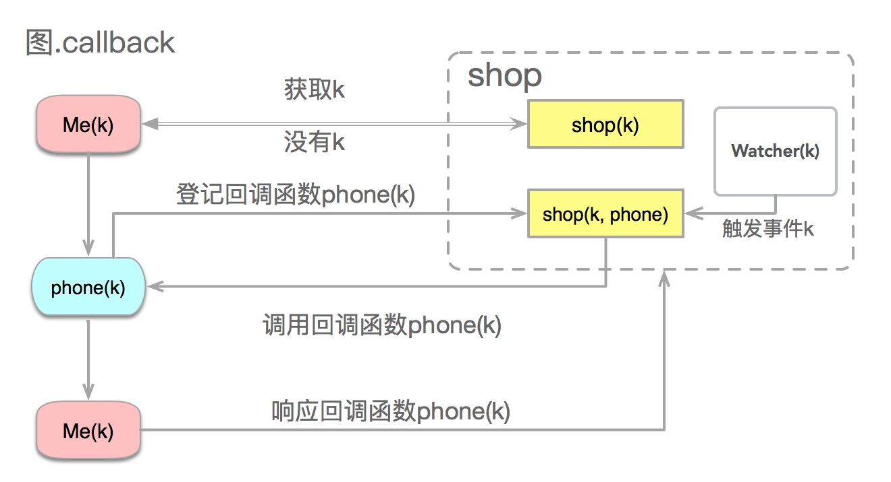

回调函数

**你**到一个**商店**买东西，刚好你要的东西没有**货**，于是你在店员那里留下了你的**电话**，过了几天店里有**货**了，**店员就打了你的电话**，然后你接到电话后就到店里去取了货。在这个例子里，你的电话号码就叫回调函数，你把电话留给店员就叫**登记回调函数**，店里后来有货了叫做**触发了回调关联的事件**，店员给你打电话叫做**调用回调函数**，你到店里去取货叫做**响应回调事件**。



**event.py**：
```
## 回调函数1
## 生成一个2x的偶数
def double(x):
    return x * 2

## 回调函数2
## 生成一个4x的偶数
def quadruple(x):
    return x * 4
```

**callback_demo.py**
```
from event import *

## 中间函数
## 接受一个生成偶数的函数作为参数
## 返回一个奇数
def getNumber(k, getEventNumber):
    return 1 + getEventNumber(k)

## 起始函数，主函数
def main():
    k = 1

    i = getNumber(k, double)
    print(i)

    i = getNumber(k, quadruple)
    print(i)

    i = getNumber(k, lambda x: x * 8)
    print(i)

if __name__ == "__main__":
    main()
```

