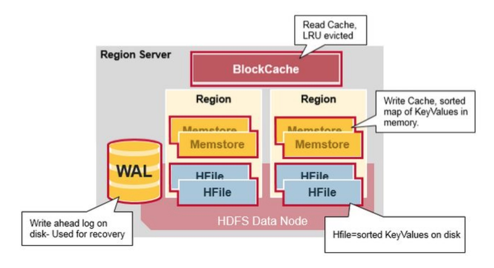
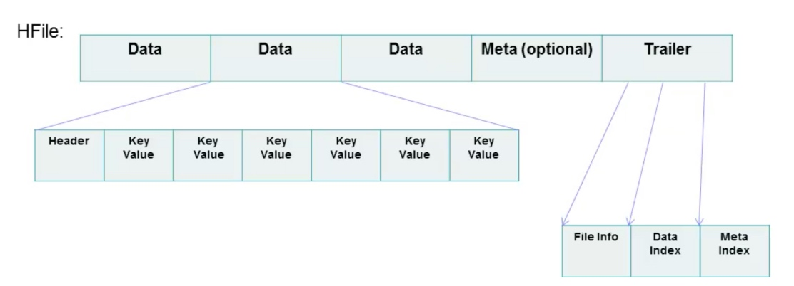
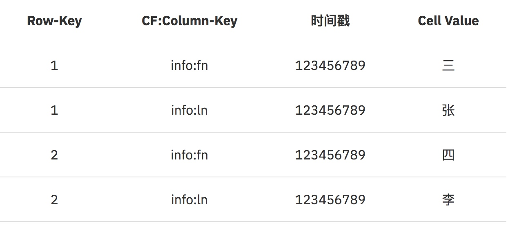

HBase

[TOC]

### HBase简介
HBase是一个高可靠、高性能、面向列、可伸缩的分布式存储系统，其特点：  
* **强一致性读写**，但不是“**最终一致性**”。
    * HBase符合CP理论。CAP指Consistency（一致性）、Availability（可用性）、Partition Tolerangce（分区容错性）。
* **自动分片(Automatic Sharding)**：HBase表通过region分布在集群中，数据增长时，region会自动分割并重新分布。
* Region Server自动故障转移。
* Hadoop/HDFS 集成: HBase 支持本机外HDFS 作为它的分布式文件系统。
* MapReduce: HBase 通过MapReduce支持大并发处理， HBase 可以同时做源和目标。
* Java 客户端 API: HBase 支持易于使用的 Java API 进行编程访问。
* Block Cache 和 Bloom Filters: 对于大容量查询优化， HBase支持 Block Cache 和 Bloom Filters。
* Thrift/REST API:HBase 也支持Thrift和 REST 作为非Java 前端。
* 运维管理: HBase提供内置网页用于运维视角和JMX 度量。

### HBase体系架构

**ZooKeeper**
* 保证集群中只有一个Hmaster
* 存储Region的寻址
* HMaster和Region Server的高可用实现
* 存储HBase的schema和table元数据

**Master**
* 为Region server分配region
* 负责Region server的负载均衡
* 发现失效的Region server并重新分配其上的region
* 管理用户对table的增删改操作

**Region Server**

* 一个Region Server最多管理1000个Region。
* HRegionServer中有基于LRU的Block Cache机制。每个Data块的大小可以在创建一个Table的时候通过参数指定（默认块大小64KB）。
* Region server维护region，处理对这些region的IO请求
* Region server负责切分在运行过程中变得过大的region
* hbase-env.sh配置：`export HBASE_REGIONSERVER_OPTS="-Xmx16000m$HBASE_REGIONSERVER_OPTS”`
* hbase-site.xml请求处理I/O线程数：`hbase.regionserver.handler.count`

**HLog(WAL log)**
* HLog文件就是一个普通的Hadoop Sequence File，Sequence File 的Key是HLogKey对象，HLogKey中记录了写入数据的归属信息，除了table和 region名字外，同时还包括sequence number和timestamp，timestamp是” 写入时间”，sequence number的起始值为0，或者是最近一次存入文件系 统中sequence number
* HLog SequeceFile的Value是HBase的KeyValue对象，即对应HFile中的 KeyValue。
    * 每个 Region Server 中都会有一个 HLog 的实例。
    * Region Server 会将更新操作（如 Put，Delete）先记录到 WAL（也就是 HLog）中，然后将其写入到 Store 的 MemStore，最终 MemStore 会将数据写入到持久化的 HFile 中（MemStore 到达配置的内存阀值）。  
    
**Region**
* HBase自动把表水平划分成多个区域(region)，每个region只会存储一个CF的数据，并且是CF中的一段；每个表一开始只有一个region，随着数据不断插入表，region不断增大，当增大到一个阀值的时候，region就会等分会 两个新的region（裂变）。
* 当table中的行不断增多，就会有越来越多的region。这样一张完整的表 被保存在多个Regionserver上。
* hbase-site.xml配置大小：`hbase.hregion.max.filesize`

**MemStore与Storefile**
* 一个region由多个store组成，一个store对应一个CF（列族）
* store包括位于内存中的memstore和位于磁盘的storefile
* 当storefile文件的数量增长到一定阈值后，系统会进行合并（minor、 major compaction），在合并过程中会进行版本合并和删除工作 （majar），形成更大的storefile
* 当一个region所有storefile的大小和超过一定阈值后，会把当前的region分割为两个，并由hmaster分配到相应的region server服务器，实现负载均衡
* 客户端检索数据，先在memstore找，找不到再找storefile
* `hbase.regionserver.global.memstore.upperLimit`，RegionServer中所有memstores占用堆的大小参数配置，默认值是0.4，表示40%，如果设置为0，就是对选项进行屏蔽。
* `hbase.hregion.memstore.flush.size`，Memstore中缓存的内容超过配置的范围后将会写到磁盘上。

**HFile**

* HFile 由很多个数据块（Block）组成，并且有一个固定的结尾块。
* 数据块是由一个 Header 和多个 Key-Value 的键值对组成，在结尾的数据块中包含了数据相关的索引信息，系统也是通过结尾的索引信息找到 HFile 中的数据。
* HFile 中的数据块大小默认为 64KB。如果访问 HBase 数据库的场景多为有序的访问，那么建议将该值设置的大一些。如果场景多为随机访问，那么建议将该值设置的小一些。

### HBase设计

#### 数据模型
**Row Key**
* 决定一行数据的唯一标识
* RowKey按字典顺序排序
* RowKey最多只存储64K字节数据

**Column Family（CF) && QUALIFIER**
* HBase表中的每个列都归属于某个列族，列族必须作为表模式(schema) 定义的一部分预先给出
* 权限控制、存储以及调优都是在列族层面进行的
* HBase把同一列族里面的数据存储在同一目录下，由几个文件保存
* HBase的列族能能够很好处理最多不超过3个列族
* 列名以列族作为前缀，每个“列族”都可以有多个列成员(column，每个列族中可以存放几千~上千万个列)；如 CF1:q1, CF2:qw,新的列族成员（列）可以随后按需、动态加入，Family下面可以有多个Qualifier，所以可以简单的理解为，HBase中的列是二级列,也就是说Family是第一级列，Qualifier是第二级列。两个是父子关系

**Timestamp**
* 在HBase每个cell存储单元对同一份数据有多个版本，根据唯一的时间戳来区分每个版本之间的差异，不同版本的数据按照**时间倒序**排序，最新的数据版本排在最前面
* 时间戳的类型是64位整型
* 时间戳可以由HBase(在数据写入时自动)赋值，此时时间戳是精确到毫 秒的当前系统时间
* 时间戳也可以由客户显式赋值，如果应用程序要避免数据版本冲突， 就必须自己生成具有唯一性的时间戳

**Cell单元格**
* 由行和列的坐标交叉决定
* 单元格是有版本的（由时间戳来作为版本）
* 单元格的内容是未解析的字节数组（Byte[]），cell中的数据是没有类型的，全部是字节码形式存贮
* 由{row key，column(=<family> +<qualifier>)，version}唯一确定的单元

如下图： 
   
**逻辑上数据排布**：  

**物理数据存储**：  

在HBase中，**Row-Key**、**CF**及**Qulifier**(图中fn和ln称为Column-key或者Qulifimer)再加一个**时间戳**才能定位到一个单元格数据（HBase中每个单元格默认有3个时间戳的版本数据)。

### 