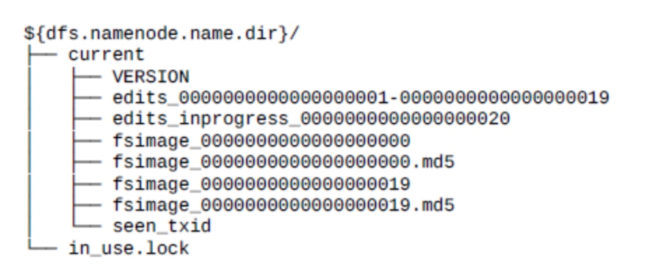
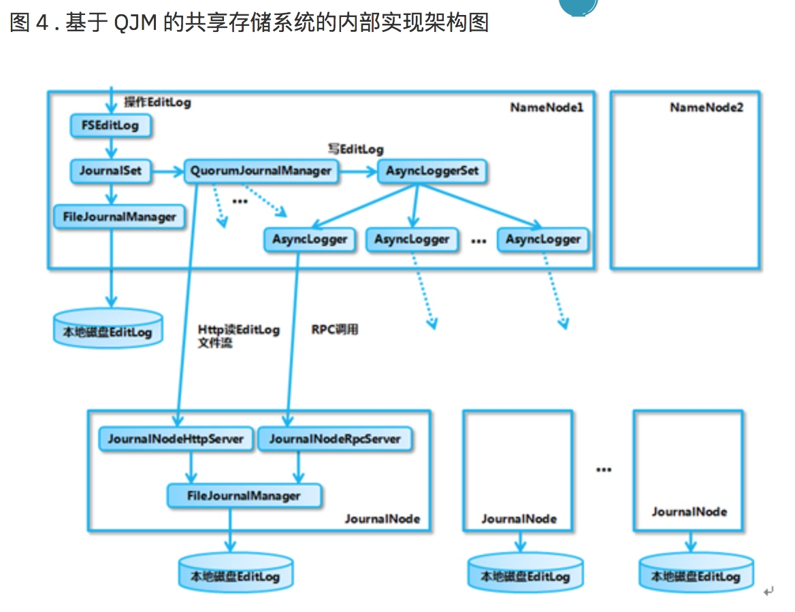
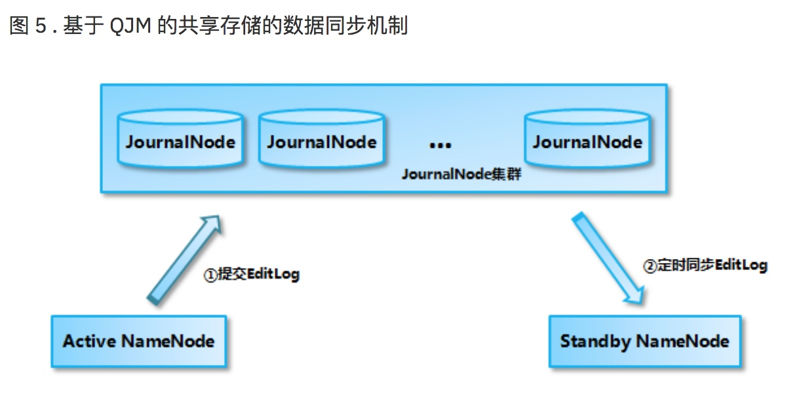
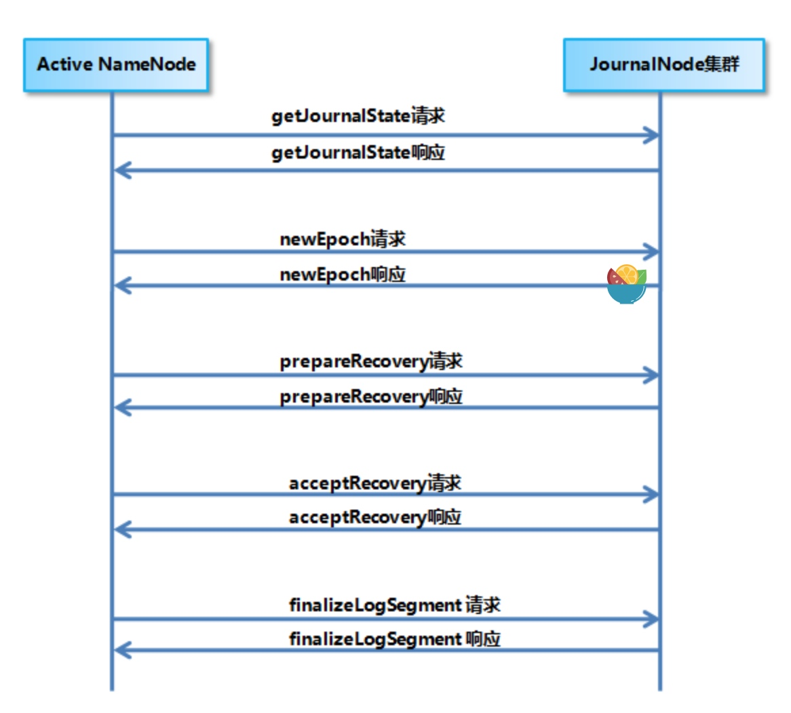

Hdfs NameNode高可用

[TOC]

### 高可用整体架构
在2.0.0版本前，Namenode存在单点故障，具体见[官网](http://hadoop.apache.org/docs/stable/hadoop-project-dist/hadoop-hdfs/HDFSHighAvailabilityWithQJM.html)。  

自动故障转移为HDFS添加了两个组件：**ZK quorum**和**ZKFailoverController process**(**ZKFC**)。
  
---
高可用整体架构

从上图中，NameNode高可用架构主要包含几部分：  
* **Active NameNode** 和 **Standby NameNode** - 两台NameNode形成互备，只有Active NameNode对外提供读写服务。
* 主备切换控制器(**ZKFailoverController，简称ZKFC**) - ZKFC控制着NameNode主备的切换。
* **ZooKeeper Cluster** - 为主备切换器(**`ZKFC`**)提供主备选举。
* **共享存储** - 共享存储保存了NameNode在运行过程中产生的HDFS的元数据。Active NameNode和Standby NameNode通过共享存储实现元数据同步。在主备切换的时候，新的active NameNode在确认元数据完全同步之后才继续对外提供服务。
* **DataNode** - 除了通过共享存储共享HDFS的元数据信息之外，主备NameNode还需要共享HDFS的数据块和DataNode之间的映射关系。DataNode会同时向active NameNode和standby NameNode上报数据块的位置信息。

### NameNode主备切换实现 
ZKFC作为NameNode上一个独立的进程启动，在启动的时候会创建**HealthMonitor**和**ActiveStandbyElector**两个内部组件，ZKFC在创建这两个组件的同时也会向HealthMonitor和ActiveStandbyElector注册相应的回调方法。
  
**HealthMonitor**，负责检测NameNode监控状态，如果检测到NameNode状态发生变化，则回调ZKFC的方法进行自动的主备选举。  
  
**ActiveStandbyElector**，负责完成自动的主备选举，选举算法来自于内部封装的ZooKeeper的处理逻辑，ZK主备选举完成，回调ZKFC的方法进行主备状态切换。  
  
NameNode主备切换的流程如下图：

* HealthMonitor初始化完成后启动内部的线程定时调用NameNode的HAServiceProtocol RPC接口方法，对NameNode健康状态进行检测。
* HealthMonitor检测到NameNode健康状态发生变化，回调ZKFC注册的方法进行处理。
* ActiveStandbyElector与ZooKeeper交互完成自动的主备选举。
* ActiveStandbyElector在主备选举完成后，回调ZKFC的方法通知当前NameNode成为主NameNode或备NameNode。
* ZKFC调用对应NameNode的HAServiceProtocol RPC接口方法将NameNode状态为Active或者Standby状态。

### HealthMonitor实现
ZKFC在初始化的时候会创建HealthMonitor，HM在内部启动一个线程循环调用NameNode和HAServiceProtocol RPC接口方法检测NameNode状态，并将状态变化通过回调的方式通知ZKFC。  
  
HM主要检测NameNode的两种状态，分别是**HealthMonitor.State**和**HAServiceStatus**。HealthMonitor.State 是通过 HAServiceProtocol RPC 接口的 monitorHealth 方法来获取的，反映了 NameNode 节点的健康状况，主要是磁盘存储资源是否充足。HealthMonitor.State 包括下面几种状态：  
* **INITIALIZING**：HealthMonitor 在初始化过程中，还没有开始进行健康状况检测；
* **SERVICE_HEALTHY**：NameNode 状态正常；
* **SERVICE_NOT_RESPONDING**：调用 NameNode 的 monitorHealth 方法调用无响应或响应超时；
* **SERVICE_UNHEALTHY**：NameNode 还在运行，但是 monitorHealth 方法返回状态不正常，磁盘存储资源不足；
* **HEALTH_MONITOR_FAILED**：HealthMonitor 自己在运行过程中发生了异常，不能继续检测 NameNode 的健康状况，会导致 ZKFailoverController 进程退出；

HAServiceStatus 则是通过 HAServiceProtocol RPC 接口的 getServiceStatus 方法来获取的，主要反映的是 NameNode 的 HA 状态，包括：
* **INITIALIZING**：NameNode 在初始化过程中；
* **ACTIVE**：当前 NameNode 为主 NameNode；
* **STANDBY**：当前 NameNode 为备 NameNode；
* **STOPPING**：当前 NameNode 已停止；

其中，HealthMonitor.State 在状态检测之中起主要的作用，HAServiceStatus 在状态检测之中只是起辅助的作用。HealthMonitor.State发生变化的时候，HealthMonitor 会回调 ZKFailoverController 的相应方法来进行处理；HAServiceStatus 发生变化时，HealthMonitor 也会回调 ZKFailoverController 的相应方法来进行处理。

### ActiveStandbyElector实现
Namenode(包括 YARN ResourceManager) 的主备选举是通过 ActiveStandbyElector 来完成的，ActiveStandbyElector 主要是利用了 Zookeeper 的写一致性和临时节点机制，具体的主备选举实现如下：
* **创建锁节点**  
HealthMonitor 检测到对应的 NameNode 的状态正常，则表示该NameNode有资格参加ZK的主备选举。  
如果目前还没有进行过主备选举的话，那么相应的 ActiveStandbyElector 就会发起一次主备选举，尝试在 Zookeeper 上创建一个路径为**/hadoop-ha/\${dfs.nameservices}/ActiveStandbyElectorLock** 的临时节点 (\${dfs.nameservices} 为 Hadoop 的配置参数 dfs.nameservices 的值，下同)，Zookeeper 的写一致性会保证最终只会有一个 ActiveStandbyElector 创建成功，那么创建成功的 ActiveStandbyElector 对应的 NameNode 就会成为主 NameNode，ActiveStandbyElector 会回调 ZKFailoverController 的方法进一步将对应的 NameNode 切换为 Active 状态。而创建失败的 ActiveStandbyElector 对应的 NameNode 成为备 NameNode，ActiveStandbyElector 会回调 ZKFailoverController 的方法进一步将对应的 NameNode 切换为 Standby 状态。
* **注册Watcher监听**  
不管创建/hadoop-ha/${dfs.nameservices}/ActiveStandbyElectorLock 节点是否成功，ActiveStandbyElector 随后都会向 Zookeeper 注册一个 Watcher 来监听这个节点的状态变化事件，ActiveStandbyElector 主要关注这个节点的 NodeDeleted 事件。
* **自动触发主备选举**  
Active NameNode 对应的 HealthMonitor 检测到 NameNode 状态异常时， ZKFailoverController 会主动删除当前在 Zookeeper 上建立的临时节点**/hadoop-ha/\${dfs.nameservices}/ActiveStandbyElectorLock**，这样处于 Standby 状态的 NameNode 的 ActiveStandbyElector 注册的监听器就会收到这个节点的 NodeDeleted 事件。收到这个事件之后，会马上再次进入到创建**/hadoop-ha/\${dfs.nameservices}/ActiveStandbyElectorLock** 节点的流程，如果创建成功，这个本来处于 Standby 状态的 NameNode 就选举为主 NameNode 并随后开始切换为 Active 状态。  
当然，如果是 Active 状态的 NameNode 所在的机器整个宕掉的话，那么根据 Zookeeper 的临时节点特性，/hadoop-ha/\${dfs.nameservices}/ActiveStandbyElectorLock 节点会自动被删除，从而也会自动进行一次主备切换。
* **防止脑裂 - fencing**  
ActiveStandbyElector 为了实现 fencing，会在成功创建 Zookeeper 节点 **hadoop-ha/\${dfs.nameservices}/ActiveStandbyElectorLock** 从而成为 Active NameNode 之后，创建另外一个路径为**/hadoop-ha/\${dfs.nameservices}/ActiveBreadCrumb** 的持久节点，这个节点里面保存了这个 Active NameNode 的地址信息。  
Active NameNode 的 ActiveStandbyElector 在正常的状态下关闭 Zookeeper Session 的时候 (注意由于**/hadoop-ha/\${dfs.nameservices}/ActiveStandbyElectorLock** 是临时节点，也会随之删除)，会一起删除节点**/hadoop-ha/${dfs.nameservices}/ActiveBreadCrumb**。  
但是如果 ActiveStandbyElector 在异常的状态下 Zookeeper Session 关闭 (比如前述的 Zookeeper 假死)，那么由于/hadoop-ha/\${dfs.nameservices}/ActiveBreadCrumb 是持久节点，会一直保留下来。后面当另一个 NameNode 选主成功之后，会注意到上一个 Active NameNode 遗留下来的这个节点，从而会回调 ZKFailoverController 的方法对旧的 Active NameNode 进行 fening。

### ZKFC实现
ZKFailoverController 在创建 HealthMonitor 和 ActiveStandbyElector 的同时，会向 HealthMonitor 和 ActiveStandbyElector 注册相应的回调函数，ZKFailoverController 的处理逻辑主要靠 **HealthMonitor** 和 **ActiveStandbyElector** 的回调函数来驱动。  
  
**对 HealthMonitor 状态变化的处理**  
HealthMonitor 会检测 NameNode 的两类状态，HealthMonitor.State 在状态检测之中起主要的作用，ZKFailoverController 注册到 HealthMonitor 上的处理 HealthMonitor.State 状态变化的回调函数主要关注 **SERVICE_HEALTHY**、**SERVICE_NOT_RESPONDING** 和 **SERVICE_UNHEALTHY** 这 3 种状态：  
* 如果检测到状态为 SERVICE_HEALTHY，表示当前的 NameNode 有资格参加 Zookeeper 的主备选举，如果目前还没有进行过主备选举的话，ZKFailoverController 会调用 ActiveStandbyElector 的 joinElection 方法发起一次主备选举。
* 如果检测到状态为 SERVICE_NOT_RESPONDING 或者是 SERVICE_UNHEALTHY，就表示当前的 NameNode 出现问题了，ZKFailoverController 会调用 ActiveStandbyElector 的 quitElection 方法删除当前已经在 Zookeeper 上建立的临时节点退出主备选举，这样其它的 NameNode 就有机会成为主 NameNode。

HAServiceStatus 在状态检测之中仅起辅助的作用，在 HAServiceStatus 发生变化时，ZKFailoverController 注册到 HealthMonitor 上的处理 HAServiceStatus 状态变化的回调函数会判断 NameNode 返回的 HAServiceStatus 和 ZKFailoverController 所期望的是否一致，如果不一致的话，ZKFailoverController 也会调用 ActiveStandbyElector 的 quitElection 方法删除当前已经在 Zookeeper 上建立的临时节点退出主备选举。
  
**对 ActiveStandbyElector 主备选举状态变化的处理**  
  在 ActiveStandbyElector 的主备选举状态发生变化时，会回调 ZKFailoverController 注册的回调函数来进行相应的处理：  
  * 如果 ActiveStandbyElector 选主成功，那么 ActiveStandbyElector 对应的 NameNode 成为主 NameNode，ActiveStandbyElector 会回调 ZKFailoverController 的 becomeActive 方法，这个方法通过调用对应的 NameNode 的 HAServiceProtocol RPC 接口的 transitionToActive 方法，将 NameNode 转换为 Active 状态。
  * 如果 ActiveStandbyElector 选主失败，那么 ActiveStandbyElector 对应的 NameNode 成为备 NameNode，ActiveStandbyElector 会回调 ZKFailoverController 的 becomeStandby 方法，这个方法通过调用对应的 NameNode 的 HAServiceProtocol RPC 接口的 transitionToStandby 方法，将 NameNode 转换为 Standby 状态。
  * 如果 ActiveStandbyElector 选主成功之后，发现了上一个 Active NameNode 遗留下来的/hadoop-ha/${dfs.nameservices}/ActiveBreadCrumb 节点 (见“ActiveStandbyElector 实现分析”一节“防止脑裂”部分所述)，那么 ActiveStandbyElector 会首先回调 ZKFailoverController 注册的 fenceOldActive 方法，尝试对旧的 Active NameNode 进行 fencing。

  **fencing的操作：**  
    
  * 首先尝试调用这个旧 Active NameNode 的 HAServiceProtocol RPC 接口的 transitionToStandby 方法，看能不能把它转换为 Standby 状态。
  * 如果 transitionToStandby 方法调用失败，那么就执行 Hadoop 配置文件之中预定义的隔离措施，hadoop目前主要提供两种隔离措施，通常会选择sshfence：
      * sshfence：通过 SSH 登录到目标机器上，执行命令 fuser 将对应的进程杀死；
      * shellfence：执行一个用户自定义的 shell 脚本来将对应的进程隔离；  

只有在成功地执行完成 fencing 之后，选主成功的 ActiveStandbyElector 才会回调 ZKFailoverController 的 becomeActive 方法将对应的 NameNode 转换为 Active 状态，开始对外提供服务。

### NameNode共享存储实现   
> 基于QJM（Quorum Journal Manager）的共享存储。  
   
#### NameNode 的元数据存储概述 
一个典型的 NameNode 的元数据存储目录结构如图，主要关注其中的EditLog 文件和 FSImage 文件：  

  
NameNode 在执行 HDFS 客户端提交的创建文件或者移动文件这样的写操作的时候，会首先把这些操作记录在 EditLog 文件之中，然后再更新内存中的文件系统镜像。内存中的文件系统镜像用于 NameNode 向客户端提供读服务，而 EditLog 仅仅只是在数据恢复的时候起作用。  
记录在 EditLog 之中的每一个操作又称为一个事务，每个事务有一个整数形式的事务 id 作为编号。EditLog 会被切割为很多段，每一段称为一个 Segment。正在写入的 EditLog Segment 处于 in-progress 状态，其文件名形如 edits_inprogress_\${start_txid}，其中\${start_txid} 表示这个 segment 的起始事务 id，例如上图中的 edits_inprogress_0000000000000000020。而已经写入完成的 EditLog Segment 处于 finalized 状态，其文件名形如 edits_\${start_txid}-\${end_txid}，其中\${start_txid} 表示这个 segment 的起始事务 id，\${end_txid} 表示这个 segment 的结束事务 id，例如上图中的 edits_0000000000000000001-0000000000000000019。  
  
NameNode 会定期对内存中的文件系统镜像进行 checkpoint 操作，在磁盘上生成 FSImage 文件，FSImage 文件的文件名形如 fsimage_\${end_txid}，其中\${end_txid} 表示这个 fsimage 文件的结束事务 id，例如上图中的 fsimage_0000000000000000020。在 NameNode 启动的时候会进行数据恢复，首先把 FSImage 文件加载到内存中形成文件系统镜像，然后再把 EditLog 之中 FsImage 的结束事务 id 之后的 EditLog 回放到这个文件系统镜像上。
#### 基于 QJM 的共享存储系统的总体架构  
基于 QJM 的共享存储系统主要用于保存 EditLog，并不保存 FSImage 文件。FSImage 文件还是在 NameNode 的本地磁盘上。QJM 共享存储的基本思想来自于 Paxos 算法，采用多个称为 JournalNode 的节点组成的 JournalNode 集群来存储 EditLog。  
每个 JournalNode 保存同样的 EditLog 副本。每次 NameNode 写 EditLog 的时候，除了向本地磁盘写入 EditLog 之外，也会并行地向 JournalNode 集群之中的每一个 JournalNode 发送写请求，只要大多数 (majority) 的 JournalNode 节点返回成功就认为向 JournalNode 集群写入 EditLog 成功。如果有 2N+1 台 JournalNode，那么根据大多数的原则，最多可以容忍有 N 台 JournalNode 节点挂掉。  

基于 QJM 的共享存储系统的内部实现架构图如图：

* **FSEditLog**：这个类封装了对 EditLog 的所有操作，是 NameNode 对 EditLog 的所有操作的入口。
* **JournalSet**： 这个类封装了对本地磁盘和 JournalNode 集群上的 EditLog 的操作，内部包含了两类 JournalManager，一类为 FileJournalManager，用于实现对本地磁盘上 EditLog 的操作。一类为 QuorumJournalManager，用于实现对 JournalNode 集群上共享目录的 EditLog 的操作。FSEditLog 只会调用 JournalSet 的相关方法，而不会直接使用 FileJournalManager 和 QuorumJournalManager。
    * **FileJournalManager**：封装了对本地磁盘上的 EditLog 文件的操作，不仅 NameNode 在向本地磁盘上写入 EditLog 的时候使用 FileJournalManager，JournalNode 在向本地磁盘写入 EditLog 的时候也复用了 FileJournalManager 的代码和逻辑。
    * **QuorumJournalManager**：封装了对 JournalNode 集群上的 EditLog 的操作，它会根据 JournalNode 集群的 URI 创建负责与 JournalNode 集群通信的类 AsyncLoggerSet， QuorumJournalManager 通过 AsyncLoggerSet 来实现对 JournalNode 集群上的 EditLog 的写操作，对于读操作，QuorumJournalManager 则是通过 Http 接口从 JournalNode 上的 JournalNodeHttpServer 读取 EditLog 的数据。
    * **AsyncLoggerSet**：内部包含了与 JournalNode 集群进行通信的 AsyncLogger 列表，每一个 AsyncLogger 对应于一个 JournalNode 节点，另外 AsyncLoggerSet 也包含了用于等待大多数 JournalNode 返回结果的工具类方法给 QuorumJournalManager 使用。
    * **AsyncLogger**：具体的实现类是 IPCLoggerChannel，IPCLoggerChannel 在执行方法调用的时候，会把调用提交到一个单线程的线程池之中，由线程池线程来负责向对应的 JournalNode 的 JournalNodeRpcServer 发送 RPC 请求。
    * **JournalNodeRpcServer**：运行在 JournalNode 节点进程中的 RPC 服务，接收 NameNode 端的 AsyncLogger 的 RPC 请求。JournalNodeHttpServer：运行在 JournalNode 节点进程中的 Http 服务，用于接收处于 Standby 状态的 NameNode 和其它 JournalNode 的同步 EditLog 文件流的请求。

#### 基于 QJM 的共享存储系统的数据同步机制分析
Active NameNode 和 StandbyNameNode 使用 JouranlNode 集群来进行数据同步的过程如图 5 所示，Active NameNode 首先把 EditLog 提交到 JournalNode 集群，然后 Standby NameNode 再从 JournalNode 集群定时同步 EditLog：  

当处于 Active 状态的 NameNode 调用 FSEditLog 类的 logSync 方法来提交 EditLog 的时候，会通过 JouranlSet 同时向本地磁盘目录和 JournalNode 集群上的共享存储目录写入 EditLog。写入 JournalNode 集群是通过并行调用每一个 JournalNode 的 QJournalProtocol RPC 接口的 journal 方法实现的，如果对大多数 JournalNode 的 journal 方法调用成功，那么就认为提交 EditLog 成功，否则 NameNode 就会认为这次提交 EditLog 失败。提交 EditLog 失败会导致 Active NameNode 关闭 JournalSet 之后退出进程，留待处于 Standby 状态的 NameNode 接管之后进行数据恢复。  

从上面可以看出，Active NameNode 提交 EditLog 到 JournalNode 集群的过程实际上是同步阻塞的，但是并不需要所有的 JournalNode 都调用成功，只要大多数 JournalNode 调用成功就可以了。如果无法形成大多数，那么就认为提交 EditLog 失败，NameNode 停止服务退出进程。
  
**Standby NameNode 从 JournalNode 集群同步 EditLog**  
当 NameNode 进入 Standby 状态之后，会启动一个 EditLogTailer 线程。这个线程会定期调用 EditLogTailer 类的 doTailEdits 方法从 JournalNode 集群上同步 EditLog，然后把同步的 EditLog 回放到内存之中的文件系统镜像上 (并不会同时把 EditLog 写入到本地磁盘上)。    
虽然 Active NameNode 向 JournalNode 集群提交 EditLog 是同步的，但 Standby NameNode 采用的是定时从 JournalNode 集群上同步 EditLog 的方式，那么 Standby NameNode 内存中文件系统镜像有很大的可能是落后于 Active NameNode 的，所以 Standby NameNode 在转换为 Active NameNode 的时候需要把落后的 EditLog 补上来。
#### 基于 QJM 的共享存储系统的数据恢复机制分析
首先，JournalNode集群各个节点的EditLog恢复一致，然后处于Standby的NameNode从JournalNode集群补齐落后的EditLog，这两步完成后当前新的ActiveNameNode才对外提供服务。在达成一致的过程中，Active NameNode 和 JournalNode 集群之间的交互流程如图 :  

**生成一个新的 Epoch**
Epoch 是一个单调递增的整数，用来标识每一次 Active NameNode 的生命周期，每发生一次 NameNode 的主备切换，Epoch 就会加 1。产生新Epoch过程：  
* Active NameNode 首先向 JournalNode 集群发送 getJournalState RPC 请求，每个 JournalNode 会返回自己保存的最近的那个 Epoch(代码中叫 lastPromisedEpoch)。
* NameNode 收到大多数的 JournalNode 返回的 Epoch 之后，在其中选择最大的一个加 1 作为当前的新 Epoch，然后向各个 JournalNode 发送 newEpoch RPC 请求，把这个新的 Epoch 发给各个 JournalNode。
* 每一个 JournalNode 在收到新的 Epoch 之后，首先检查这个新的 Epoch 是否比它本地保存的 lastPromisedEpoch 大，如果大的话就把 lastPromisedEpoch 更新为这个新的 Epoch，并且向 NameNode 返回它自己的本地磁盘上最新的一个 EditLogSegment 的起始事务 id，为后面的数据恢复过程做好准备。如果小于或等于的话就向 NameNode 返回错误。
* NameNode 收到大多数 JournalNode 对 newEpoch 的成功响应之后，就会认为生成新的 Epoch 成功。

**选择需要数据恢复的 EditLog Segment 的 id**  
需要恢复的 Edit Log 只可能是各个 JournalNode 上的最后一个 Edit Log Segment，如前所述，JournalNode 在处理完 newEpoch RPC 请求之后，会向 NameNode 返回它自己的本地磁盘上最新的一个 EditLog Segment 的起始事务 id，这个起始事务 id 实际上也作为这个 EditLog Segment 的 id。NameNode 会在所有这些 id 之中选择一个最大的 id 作为要进行数据恢复的 EditLog Segment 的 id。  

**向 JournalNode 集群发送 prepareRecovery RPC 请求**  
NameNode 接下来向 JournalNode 集群发送 prepareRecovery RPC 请求，请求的参数就是选出的 EditLog Segment 的 id。JournalNode 收到请求后返回本地磁盘上这个 Segment 的起始事务 id、结束事务 id 和状态 (in-progress 或 finalized)。 只要大多数的 JournalNode 的 prepareRecovery RPC 调用成功返回，NameNode 就认为成功。   
选择进行同步的基准数据源，向 JournalNode 集群发送 acceptRecovery RPC 请求 NameNode 根据 prepareRecovery 的返回结果，选择一个 JournalNode 上的 EditLog Segment 作为同步的基准数据源。  
**选择基准数据源的原则大致是：**在 in-progress 状态和 finalized 状态的 Segment 之间优先选择 finalized 状态的 Segment。如果都是 in-progress 状态的话，那么优先选择 Epoch 比较高的 Segment(也就是优先选择更新的)，如果 Epoch 也一样，那么优先选择包含的事务数更多的 Segment。  
在选定了同步的基准数据源之后，NameNode 向 JournalNode 集群发送 acceptRecovery RPC 请求，将选定的基准数据源作为参数。JournalNode 接收到 acceptRecovery RPC 请求之后，从基准数据源 JournalNode 的 JournalNodeHttpServer 上下载 EditLog Segment，将本地的 EditLog Segment 替换为下载的 EditLog Segment。    
只要大多数 JournalNode 的 acceptRecovery RPC 调用成功返回，NameNode 就认为成功。  

**向 JournalNode 集群发送 finalizeLogSegment RPC 请求，数据恢复完成**  
NameNode 向 JournalNode 集群发送 finalizeLogSegment RPC 请求，JournalNode 接收到请求之后，将对应的 EditLog Segment 从 in-progress 状态转换为 finalized 状态。  
只要大多数 JournalNode 的 finalizeLogSegment RPC 调用成功返回，NameNode 就认为成功。  

#### NameNode 在进行状态转换时对共享存储的处理
##### NameNode 初始化启动，进入 Standby 状态
在 NameNode 以 HA 模式启动的时候，NameNode 会认为自己处于 Standby 模式，在 NameNode 的构造函数中会加载 FSImage 文件和 EditLog Segment 文件来恢复自己的内存文件系统镜像。在加载 EditLog Segment 的时候，调用 FSEditLog 类的 initSharedJournalsForRead 方法来创建只包含了在 JournalNode 集群上的共享目录的 JournalSet，也就是说，这个时候只会从 JournalNode 集群之中加载 EditLog，而**不会加载本地磁盘上的 EditLog**。  
另外，加载的 EditLog Segment 只是处于 finalized 状态的 EditLog Segment，而处于 in-progress 状态的 Segment 需要后续在切换为 Active 状态的时候，进行一次数据恢复过程，将 in-progress 状态的 Segment 转换为 finalized 状态的 Segment 之后再进行读取。  
加载完 FSImage 文件和共享目录上的 EditLog Segment 文件之后，NameNode 会启动 EditLogTailer 线程和 StandbyCheckpointer 线程，正式进入 Standby 模式。
##### NameNode 从 Standby 状态切换为 Active 状态
首先就是停止它在 Standby 状态的时候启动的线程和相关的服务，包括上面提到的 EditLogTailer 线程和 StandbyCheckpointer 线程，然后关闭用于读取 JournalNode 集群的共享目录上的 EditLog 的 JournalSet，接下来会调用 FSEditLog 的 initJournalSetForWrite 方法重新打开 JournalSet。不同的是，这个 JournalSet 内部同时包含了本地磁盘目录和 JournalNode 集群上的共享目录。这些工作完成之后，就开始执行“基于 QJM 的共享存储系统的数据恢复机制分析”一节所描述的流程，调用 FSEditLog 类的 recoverUnclosedStreams 方法让 JournalNode 集群中各个节点上的 EditLog 达成一致。然后调用 EditLogTailer 类的 catchupDuringFailover 方法从 JournalNode 集群上补齐落后的 EditLog。最后打开一个新的 EditLog Segment 用于新写入数据，同时启动 Active NameNode 所需要的线程和服务。
##### NameNode 从 Active 状态切换为 Standby 状态
当 NameNode 从 Active 状态切换为 Standby 状态的时候，首先需要做的就是停止它在 Active 状态的时候启动的线程和服务，然后关闭用于读取本地磁盘目录和 JournalNode 集群上的共享目录的 EditLog 的 JournalSet。接下来会调用 FSEditLog 的 initSharedJournalsForRead 方法重新打开用于读取 JournalNode 集群上的共享目录的 JournalSet。这些工作完成之后，就会启动 EditLogTailer 线程和 StandbyCheckpointer 线程，EditLogTailer 线程会定时从 JournalNode 集群上同步 Edit Log。

### 附加说明
如果在采用传统的单 NameNode 的架构运行了一段时间之后，升级为 NameNode 的高可用架构的话，就要特别注意在升级的时候需要按照以下的步骤进行操作：  
* 对 Zookeeper 进行初始化，创建 Zookeeper 上的/hadoop-ha/${dfs.nameservices} 节点。创建节点是为随后通过 Zookeeper 进行主备选举做好准备，在进行主备选举的时候会在这个节点下面创建子节点 (具体可参照“ActiveStandbyElector 实现分析”一节的叙述)。这一步通过在原有的 NameNode 上执行命令 hdfs zkfc -formatZK 来完成。
* 启动所有的 JournalNode，这通过脚本命令 hadoop-daemon.sh start journalnode 来完成。
* 对 JouranlNode 集群的共享存储目录进行格式化，并且将原有的 NameNode 本地磁盘上最近一次 checkpoint 操作生成 FSImage 文件 (具体可参照“NameNode 的元数据存储概述”一节的叙述) 之后的 EditLog 拷贝到 JournalNode 集群上的共享目录之中，这通过在原有的 NameNode 上执行命令 hdfs namenode -initializeSharedEdits 来完成。
* 启动原有的 NameNode 节点，这通过脚本命令 hadoop-daemon.sh start namenode 完成。
* 对新增的 NameNode 节点进行初始化，将原有的 NameNode 本地磁盘上最近一次 checkpoint 操作生成 FSImage 文件拷贝到这个新增的 NameNode 的本地磁盘上，同时需要验证 JournalNode 集群的共享存储目录上已经具有了这个 FSImage 文件之后的 EditLog(已经在第 3 步完成了)。这一步通过在新增的 NameNode 上执行命令 hdfs namenode -bootstrapStandby 来完成。
* 启动新增的 NameNode 节点，这通过脚本命令 hadoop-daemon.sh start namenode 完成。
* 在这两个 NameNode 上启动 zkfc(ZKFailoverController) 进程，谁通过 Zookeeper 选主成功，谁就是主 NameNode，另一个为备 NameNode。这通过脚本命令 hadoop-daemon.sh start zkfc 完成。
